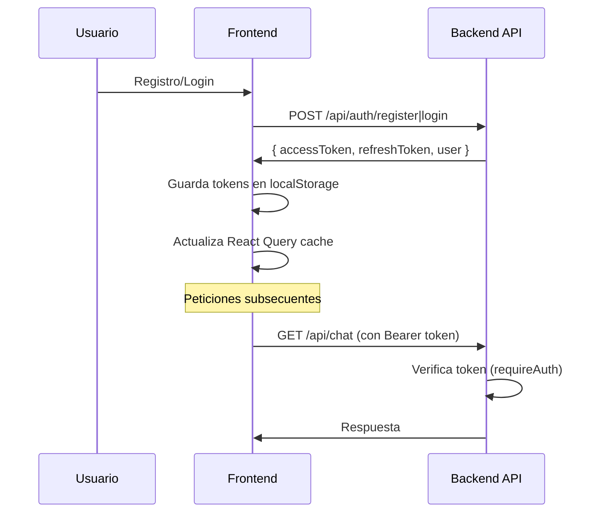
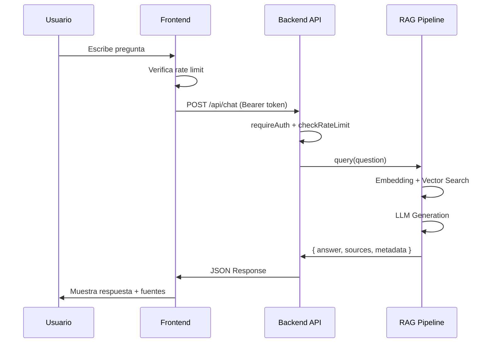
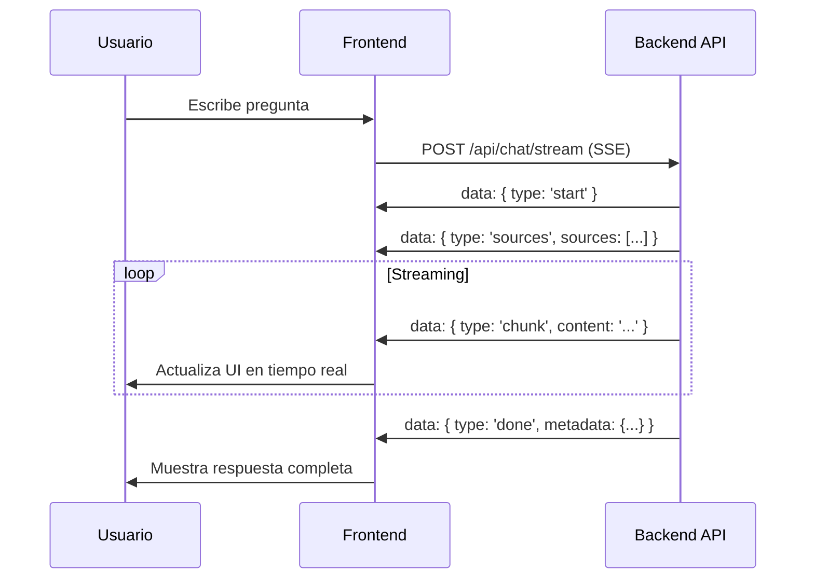

# Análisis Completo: API y Frontend de TicoBot

## 📋 Tabla de Contenidos

1. [Resumen Ejecutivo](#resumen-ejecutivo)
2. [Arquitectura del API](#arquitectura-del-api)
3. [Arquitectura del Frontend](#arquitectura-del-frontend)
4. [Integración API-Frontend](#integración-api-frontend)
5. [Flujo de Datos](#flujo-de-datos)
6. [Seguridad](#seguridad)
7. [Tecnologías Utilizadas](#tecnologías-utilizadas)
8. [Puntos Fuertes](#puntos-fuertes)
9. [Áreas de Mejora](#áreas-de-mejora)
10. [Recomendaciones](#recomendaciones)

---

## Resumen Ejecutivo

**TicoBot** es una plataforma de información electoral para Costa Rica que permite comparar propuestas políticas de forma neutral usando RAG (Retrieval-Augmented Generation). El sistema consta de:

- **Backend API**: Express.js con TypeScript, autenticación JWT, RAG pipeline, y documentación Swagger
- **Frontend**: Next.js 16 App Router con React Query, TailwindCSS, y shadcn/ui

### Características Principales

- ✅ Autenticación JWT con refresh tokens
- ✅ Chat RAG con streaming (SSE)
- ✅ Búsqueda semántica de documentos
- ✅ Gestión de documentos gubernamentales
- ✅ Rate limiting por usuario
- ✅ Sistema de auditoría y logging

---

## Arquitectura del API

### Estructura General

```
backend/src/api/
├── server.ts              # Configuración Express y rutas principales
├── swagger.ts             # Documentación OpenAPI/Swagger
├── routes/
│   ├── auth.ts           # Autenticación (register, login, refresh, logout, me)
│   ├── chat.ts           # Chat RAG (POST /api/chat, POST /api/chat/stream)
│   ├── documents.ts      # Gestión de documentos (GET /api/documents)
│   ├── search.ts         # Búsqueda semántica (POST/GET /api/search)
│   └── ingest.ts         # Ingesta de documentos (POST /api/ingest)
└── middleware/
    └── auth.middleware.ts # requireAuth, checkRateLimit, requireAdmin
```

### Endpoints Principales

#### 1. Autenticación (`/api/auth`)

```typescript
POST   /api/auth/register    # Registro de usuario
POST   /api/auth/login        # Login con email/password
POST   /api/auth/refresh      # Refresh de access token
POST   /api/auth/logout       # Logout (revoca refresh token)
GET    /api/auth/me           # Información del usuario actual
```

**Características:**
- Validación de contraseña con `zxcvbn` (mínimo 12 caracteres)
- Rate limiting en login (protección contra brute force)
- Token rotation en refresh (revoca token anterior)
- Detección de token reuse (revoca todos los tokens del usuario)
- Audit logging de eventos de seguridad

#### 2. Chat RAG (`/api/chat`)

```typescript
POST   /api/chat              # Chat normal (respuesta completa)
POST   /api/chat/stream       # Chat con streaming (Server-Sent Events)
```

**Parámetros:**
- `question`: Pregunta del usuario (1-1000 caracteres)
- `party`: Filtro opcional por partido político
- `topK`: Número de chunks a recuperar (1-10, default: 5)
- `temperature`: Temperatura del LLM (0-2, default: 0.7)
- `maxTokens`: Tokens máximos en respuesta (100-2000, default: 800)
- `minRelevanceScore`: Score mínimo de relevancia (0-1, default: 0.35)

**Respuesta:**
```json
{
  "answer": "Respuesta generada por el LLM",
  "sources": [
    {
      "id": "chunk-id",
      "content": "Contenido del chunk",
      "party": "PLN",
      "document": "PLN_2026",
      "page": "42",
      "relevanceScore": 0.85
    }
  ],
  "metadata": {
    "model": "gpt-4",
    "tokensUsed": 1200,
    "sourcesCount": 5,
    "processingTime": 2.3
  }
}
```

#### 3. Documentos (`/api/documents`)

```typescript
GET    /api/documents              # Lista documentos (paginado)
GET    /api/documents/:id          # Obtener documento por ID
GET    /api/documents/:id/chunks   # Obtener chunks de un documento
```

**Query Parameters:**
- `party`: Filtro por partido
- `limit`: Resultados por página (1-100, default: 20)
- `offset`: Offset para paginación (default: 0)

#### 4. Búsqueda (`/api/search`)

```typescript
POST   /api/search                 # Búsqueda semántica (POST)
GET    /api/search?q=query        # Búsqueda semántica (GET)
```

**Características:**
- Embedding de consulta con `QueryEmbedder`
- Búsqueda vectorial con `SemanticSearcher`
- Filtros por partido político
- Estadísticas de relevancia (avg, max, min score)

#### 5. Ingesta (`/api/ingest`)

```typescript
POST   /api/ingest                 # Ingesta de un documento
POST   /api/ingest/bulk            # Ingesta masiva
```

### Middleware de Seguridad

#### `requireAuth`
- Verifica JWT access token en header `Authorization: Bearer <token>`
- Extrae payload y lo adjunta a `req.user`
- Retorna 401 si el token es inválido o expirado

#### `checkRateLimit`
- Verifica límites diarios de queries por usuario
- Incrementa contador de queries
- Retorna 429 si se excede el límite
- Agrega headers `X-RateLimit-*`

#### `requireAdmin` / `requirePremium`
- Verifica tier del usuario
- Retorna 403 si no tiene permisos

### Validación

- **Zod** para validación de schemas
- Validación en cada endpoint antes de procesar
- Respuestas de error estructuradas con detalles

### Manejo de Errores

```typescript
// Error handler global
app.use((err: Error, req: Request, res: Response, next: NextFunction) => {
  logger.error('Unhandled error:', err);
  res.status(500).json({
    error: 'Internal Server Error',
    message: err.message
  });
});
```

### Documentación

- **Swagger UI** en `/api/docs`
- Especificación OpenAPI en `/api/docs.json`
- Documentación inline con JSDoc

---

## Arquitectura del Frontend

### Estructura General

```
frontend/
├── app/                        # Next.js App Router
│   ├── layout.tsx              # Layout raíz con providers
│   ├── page.tsx                # Página principal
│   ├── chat/                   # Página de chat
│   ├── documents/              # Página de documentos
│   ├── compare/                # Página de comparación
│   └── admin/                  # Panel de administración
├── components/                 # Componentes reutilizables
│   ├── ui/                     # Componentes shadcn/ui
│   ├── providers/              # React Query, Theme providers
│   ├── site-header.tsx          # Header del sitio
│   └── auth-dialog.tsx         # Diálogo de autenticación
├── lib/
│   ├── api/                    # Cliente API y servicios
│   │   ├── client.ts           # Cliente base con retry logic
│   │   ├── services/           # Servicios por dominio
│   │   └── types.ts            # Tipos TypeScript
│   └── hooks/                  # React Query hooks
│       ├── use-auth.ts         # Hooks de autenticación
│       ├── use-chat.ts         # Hooks de chat
│       └── use-documents.ts   # Hooks de documentos
└── styles/
    └── globals.css             # Estilos globales
```

### Stack Tecnológico

- **Framework**: Next.js 16 App Router
- **UI**: React 19, TailwindCSS, shadcn/ui
- **State Management**: TanStack Query (React Query) v5
- **Formularios**: React Hook Form + Zod
- **Notificaciones**: Sonner
- **Temas**: next-themes (dark/light mode)

### Providers y Context

#### QueryProvider
```typescript
// Configuración de React Query
- staleTime: 60s
- gcTime: 5 minutos
- retry: 1 vez
- DevTools en desarrollo
```

#### ThemeProvider
- Soporte para dark/light mode
- Persistencia de preferencia
- System preference detection

### Cliente API

#### `apiClient` (lib/api/client.ts)

**Características:**
- Retry automático en errores 5xx, 408, 429
- Timeout configurable (default: 30s)
- Manejo de errores estructurado
- Headers automáticos (`Content-Type: application/json`)

**Métodos:**
```typescript
api.get<T>(endpoint, config?)
api.post<T>(endpoint, data, config?)
api.put<T>(endpoint, data, config?)
api.patch<T>(endpoint, data, config?)
api.delete<T>(endpoint, config?)
```

**Ejemplo:**
```typescript
const response = await api.post<ChatResponse>('/api/chat', {
  question: '¿Qué proponen sobre educación?',
  topK: 5
});
```

### Servicios API

Cada dominio tiene su servicio:

- `authService`: register, login, refresh, logout, me
- `chatService`: ask, streamChat
- `documentsService`: list, getById, getChunks
- `searchService`: search
- `healthService`: check

### React Query Hooks

#### Patrón de Uso

```typescript
// Query (lectura)
const { data, isLoading, error } = useUser();

// Mutation (escritura)
const loginMutation = useLogin();
loginMutation.mutate({ email, password });
```

#### Hooks Principales

- `useUser()`: Obtener usuario actual
- `useLogin()`: Login con optimistic updates
- `useRegister()`: Registro de usuario
- `useChat()`: Enviar mensaje de chat
- `useChatStream()`: Streaming de chat
- `useDocuments()`: Listar documentos
- `useSearch()`: Búsqueda semántica

### Gestión de Autenticación

#### Almacenamiento de Tokens

```typescript
// Tokens en localStorage
localStorage.setItem('accessToken', token);
localStorage.setItem('refreshToken', refreshToken);
```

#### Inyección de Tokens

**Problema Actual:** Los tokens no se inyectan automáticamente en todas las peticiones.

**Solución Actual:** Solo en `chatService.streamChat()` se agrega manualmente:
```typescript
headers: {
  ...(localStorage.getItem('accessToken')
    ? { Authorization: `Bearer ${localStorage.getItem('accessToken')}` }
    : {}),
}
```

**⚠️ Problema:** El cliente base `apiClient` no agrega tokens automáticamente.

### Página de Chat

#### Características

- Mensajes en tiempo real
- Streaming de respuestas (SSE)
- Fuentes citadas con scores
- Historial de conversación
- Preguntas sugeridas
- Rate limiting UI (UsageBanner)
- Autenticación requerida

#### Flujo de Chat

1. Usuario escribe pregunta
2. Verifica límites de uso
3. Si no autenticado → muestra diálogo de auth
4. Envía request a `/api/chat` o `/api/chat/stream`
5. Muestra respuesta con fuentes
6. Actualiza contador de uso

---

## Integración API-Frontend

### Flujo de Autenticación



### Flujo de Chat



### Streaming de Chat



---

## Flujo de Datos

### 1. Autenticación

```
Usuario → Frontend (form) 
  → authService.login() 
  → api.post('/api/auth/login')
  → Backend (auth.routes.ts)
  → UserRepository.findByEmail()
  → verifyPassword()
  → generateTokenPair()
  → TokenRepository.create()
  → Response { accessToken, refreshToken, user }
  → Frontend: localStorage + React Query cache
```

### 2. Chat RAG

```
Usuario → Frontend (chat input)
  → chatService.ask()
  → api.post('/api/chat') con Bearer token
  → Backend (chat.routes.ts)
  → requireAuth middleware
  → checkRateLimit middleware
  → RAGPipeline.query()
    → QueryEmbedder.embed()
    → SemanticSearcher.search()
    → LLM.generate()
  → Response { answer, sources, metadata }
  → Frontend: React Query mutation
  → UI: Muestra respuesta + fuentes
```

### 3. Búsqueda Semántica

```
Usuario → Frontend (search input)
  → searchService.search()
  → api.post('/api/search')
  → Backend (search.routes.ts)
  → QueryEmbedder.embed()
  → SemanticSearcher.search()
  → Response { results, stats }
  → Frontend: React Query query
  → UI: Lista de resultados
```

---

## Seguridad

### Backend

#### ✅ Implementado

1. **Autenticación JWT**
   - Access tokens (corta duración)
   - Refresh tokens (7 días, almacenados en DB)
   - Token rotation en refresh

2. **Protección contra Ataques**
   - Rate limiting en login (brute force protection)
   - Password hashing con bcrypt
   - Validación de contraseña con zxcvbn
   - Detección de token reuse

3. **Audit Logging**
   - Eventos de autenticación
   - Intentos de acceso no autorizado
   - Rate limit excedido
   - Token reuse detectado

4. **Rate Limiting**
   - Límites diarios por tier de usuario
   - Headers `X-RateLimit-*` en respuestas

5. **Validación de Input**
   - Zod schemas en todos los endpoints
   - Sanitización de datos

#### ⚠️ Mejoras Necesarias

1. **CORS**: Configurado pero sin restricciones específicas
2. **Helmet**: No implementado (headers de seguridad)
3. **Rate Limiting Global**: Solo por usuario, no por IP
4. **HTTPS**: No forzado en producción

### Frontend

#### ✅ Implementado

1. **Manejo de Tokens**
   - Almacenamiento en localStorage
   - Refresh automático (parcial)

2. **Error Handling**
   - Manejo de errores 401 (redirect a login)
   - Manejo de errores 429 (rate limit)
   - Toast notifications

3. **Validación de Formularios**
   - React Hook Form + Zod
   - Validación client-side

#### ⚠️ Problemas Identificados

1. **Inyección de Tokens**
   - ❌ `apiClient` no agrega tokens automáticamente
   - ✅ Solo `chatService.streamChat()` lo hace manualmente
   - **Impacto**: Peticiones fallan con 401 si no se agrega token manualmente

2. **Refresh Token Automático**
   - ❌ No hay interceptor para refresh automático
   - **Impacto**: Usuario debe re-login cuando access token expira

3. **XSS Protection**
   - ⚠️ Contenido de chat renderizado sin sanitización
   - **Riesgo**: Si el LLM devuelve HTML malicioso

---

## Tecnologías Utilizadas

### Backend

| Tecnología | Versión | Propósito |
|------------|---------|-----------|
| Node.js | - | Runtime |
| TypeScript | 5.4+ | Lenguaje |
| Express | 5.2.1 | Framework web |
| Supabase | 2.39.7 | Base de datos (PostgreSQL) |
| OpenAI | 4.28.0 | LLM provider |
| jsonwebtoken | 9.0.3 | JWT |
| bcrypt | 6.0.0 | Password hashing |
| zod | 3.22.4 | Validación |
| swagger-ui-express | 5.0.1 | Documentación API |

### Frontend

| Tecnología | Versión | Propósito |
|------------|---------|-----------|
| Next.js | 16.0.3 | Framework React |
| React | 19.2.0 | UI library |
| TypeScript | 5+ | Lenguaje |
| TanStack Query | 5.90.12 | Data fetching |
| TailwindCSS | 4.1.9 | Estilos |
| shadcn/ui | - | Componentes UI |
| React Hook Form | 7.60.0 | Formularios |
| Zod | 3.25.76 | Validación |
| Sonner | 1.7.4 | Notificaciones |

---

## Puntos Fuertes

### Arquitectura

1. ✅ **Separación de responsabilidades**: API y Frontend bien separados
2. ✅ **TypeScript**: Tipado fuerte en ambos lados
3. ✅ **Modularidad**: Código organizado por dominios
4. ✅ **Documentación**: Swagger para API

### Seguridad

1. ✅ **JWT con refresh tokens**: Implementación robusta
2. ✅ **Rate limiting**: Protección contra abuso
3. ✅ **Audit logging**: Trazabilidad de eventos
4. ✅ **Validación**: Zod en todos los endpoints

### UX/UI

1. ✅ **React Query**: Caching y optimistic updates
2. ✅ **Streaming**: Respuestas en tiempo real
3. ✅ **Error handling**: Manejo de errores user-friendly
4. ✅ **Responsive**: Mobile-first design

### Performance

1. ✅ **Caching**: React Query cache
2. ✅ **Retry logic**: Reintentos automáticos
3. ✅ **Streaming**: Mejor percepción de velocidad

---

## Áreas de Mejora

### 🔴 Crítico

1. **Inyección Automática de Tokens**
   - **Problema**: `apiClient` no agrega `Authorization` header automáticamente
   - **Impacto**: Peticiones fallan con 401
   - **Solución**: Interceptor en `apiClient` que lea de localStorage

2. **Refresh Token Automático**
   - **Problema**: No hay interceptor para refresh cuando access token expira
   - **Impacto**: Usuario debe re-login frecuentemente
   - **Solución**: Interceptor que detecte 401 y haga refresh automático

### 🟡 Importante

3. **Sanitización de Contenido**
   - **Problema**: Contenido de chat renderizado sin sanitizar
   - **Riesgo**: XSS si LLM devuelve HTML
   - **Solución**: Usar `DOMPurify` o similar

4. **Manejo de Errores de Red**
   - **Problema**: Errores de red no siempre se manejan bien
   - **Solución**: Mejorar error boundaries y retry logic

5. **CORS Configuration**
   - **Problema**: CORS abierto (`app.use(cors())`)
   - **Solución**: Configurar origins específicos en producción

### 🟢 Mejoras Futuras

6. **WebSocket para Chat**
   - Actualmente usa SSE, WebSocket sería más eficiente

7. **Optimistic Updates Mejorados**
   - Más optimistic updates en mutations

8. **Offline Support**
   - Service workers para funcionar offline

9. **Testing**
   - Unit tests y integration tests faltantes

10. **Monitoring**
    - APM (Application Performance Monitoring)
    - Error tracking (Sentry, etc.)

---

## Recomendaciones

### Inmediatas (Prioridad Alta)

1. **Implementar Interceptor de Tokens**
   ```typescript
   // En lib/api/client.ts
   const token = typeof window !== 'undefined' 
     ? localStorage.getItem('accessToken') 
     : null;
   
   headers: {
     'Content-Type': 'application/json',
     ...(token ? { Authorization: `Bearer ${token}` } : {}),
     ...fetchConfig.headers,
   }
   ```

2. **Implementar Refresh Automático**
   ```typescript
   // Interceptor que detecte 401 y haga refresh
   if (response.status === 401) {
     const refreshToken = localStorage.getItem('refreshToken');
     if (refreshToken) {
       const newTokens = await authService.refresh({ refreshToken });
       // Retry request con nuevo token
     }
   }
   ```

3. **Sanitizar Contenido de Chat**
   ```typescript
   import DOMPurify from 'dompurify';
   
   <div dangerouslySetInnerHTML={{
     __html: DOMPurify.sanitize(message.content)
   }} />
   ```

### Corto Plazo (1-2 semanas)

4. **Configurar CORS**
   ```typescript
   app.use(cors({
     origin: process.env.FRONTEND_URL || 'http://localhost:3001',
     credentials: true
   }));
   ```

5. **Agregar Helmet**
   ```typescript
   import helmet from 'helmet';
   app.use(helmet());
   ```

6. **Mejorar Error Boundaries**
   - Error boundaries más específicos
   - Mejor logging de errores

### Mediano Plazo (1 mes)

7. **Testing**
   - Unit tests con Vitest
   - Integration tests para API
   - E2E tests con Playwright

8. **Monitoring**
   - Integrar Sentry para error tracking
   - APM para performance monitoring

9. **Documentación**
   - Storybook para componentes
   - Mejor documentación de hooks

### Largo Plazo (3+ meses)

10. **WebSocket Migration**
    - Migrar chat de SSE a WebSocket

11. **Offline Support**
    - Service workers
    - IndexedDB para cache local

12. **Internationalization**
    - i18n para múltiples idiomas

---

## Conclusión

El proyecto **TicoBot** tiene una base sólida con buena arquitectura y separación de responsabilidades. La implementación de seguridad es robusta en el backend, pero necesita mejoras en el frontend, especialmente en la gestión automática de tokens.

**Prioridades:**
1. 🔴 Inyección automática de tokens
2. 🔴 Refresh token automático
3. 🟡 Sanitización de contenido
4. 🟡 Configuración de CORS

Con estas mejoras, el sistema estará listo para producción.

---

**Fecha de Análisis**: 2025-01-27  
**Versión Analizada**: 0.1.0


