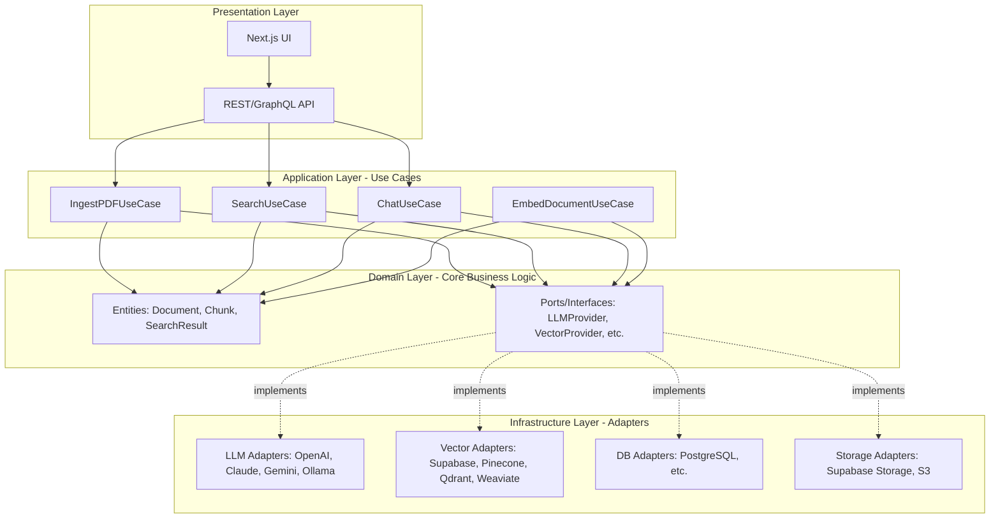

# High-Level System Architecture

## Overview

TicoBot is a Retrieval-Augmented Generation (RAG) system designed to extract, process, index, and query Costa Rica's 2026 Government Plans from the Supreme Electoral Tribunal (TSE). The system follows **Clean Architecture** principles with a **Ports & Adapters** pattern to ensure modularity, flexibility, and scalability.

## Architectural Principles

### 1. Clean Architecture
- **Separation of Concerns**: Business logic is independent of frameworks, UI, and external services
- **Dependency Inversion**: High-level modules don't depend on low-level modules; both depend on abstractions
- **Testability**: Each layer can be tested independently

### 2. Ports & Adapters (Hexagonal Architecture)
- **Ports**: Interfaces that define contracts for external services
- **Adapters**: Concrete implementations of ports (e.g., OpenAIProvider, SupabaseVectorProvider)
- **Swappability**: Providers can be changed without modifying business logic

### 3. SOLID Principles
- **Single Responsibility**: Each component has one reason to change
- **Open/Closed**: Open for extension, closed for modification
- **Liskov Substitution**: Implementations can be substituted without breaking the system
- **Interface Segregation**: Clients shouldn't depend on interfaces they don't use
- **Dependency Inversion**: Depend on abstractions, not concretions

## System Layers



## Layer Responsibilities

### Presentation Layer
**Purpose**: Handle user interactions and HTTP requests

**Components**:
- **Next.js UI**: React-based frontend with App Router
- **API Layer**: REST/GraphQL endpoints for frontend-backend communication

**Responsibilities**:
- Render user interface
- Handle HTTP requests/responses
- Format data for display
- Client-side state management

**Dependencies**: Application Layer (Use Cases)

---

### Application Layer (Use Cases)
**Purpose**: Orchestrate business operations and workflows

**Components**:
- **IngestPDFUseCase**: Download and process TSE PDFs
- **SearchUseCase**: Search through indexed documents
- **ChatUseCase**: Interactive chat with RAG context
- **EmbedDocumentUseCase**: Generate and store embeddings

**Responsibilities**:
- Coordinate workflows between domain and infrastructure
- Execute business rules
- Handle application-specific logic
- Manage transactions

**Dependencies**: Domain Layer (Entities & Ports)

---

### Domain Layer
**Purpose**: Core business logic and data models

**Components**:
- **Entities**:
  - `Document`: Represents a government plan PDF
  - `Chunk`: Text segments with embeddings
  - `SearchResult`: Query results with relevance scores
  - `Message`: Chat messages with context

- **Ports (Interfaces)**:
  - `LLMProvider`: Contract for AI language models
  - `VectorProvider`: Contract for vector databases
  - `DatabaseProvider`: Contract for data persistence
  - `StorageProvider`: Contract for file storage
  - `EmbeddingProvider`: Contract for embedding generation

**Responsibilities**:
- Define business entities
- Define contracts for external services
- Implement business rules
- No dependencies on external frameworks

**Dependencies**: None (pure TypeScript/JavaScript)

---

### Infrastructure Layer
**Purpose**: Implement concrete adapters for external services

**Components**:

**LLM Adapters**:
- `OpenAIProvider`: GPT-4, GPT-4.1, o1
- `ClaudeProvider`: Claude 3.5 Sonnet
- `GeminiProvider`: Gemini Flash, Gemini Pro
- `OllamaProvider`: Local LLM support

**Vector Database Adapters**:
- `SupabaseVectorProvider`: PostgreSQL + pgvector
- `PineconeProvider`: Pinecone vector database
- `QdrantProvider`: Qdrant vector database
- `WeaviateProvider`: Weaviate vector database

**Database Adapters**:
- `PgDatabaseProvider`: PostgreSQL for metadata

**Storage Adapters**:
- `SupabaseStorageProvider`: Supabase storage for PDFs
- `S3StorageProvider`: AWS S3 for PDFs

**Responsibilities**:
- Implement port interfaces
- Handle external API calls
- Manage provider-specific configurations
- Abstract provider implementation details

**Dependencies**: Domain Layer (Ports)

## Technology Stack

### Backend
- **Runtime**: Node.js 20+
- **Language**: TypeScript
- **Package Manager**: pnpm
- **Framework**: Express.js (API layer)

### Frontend
- **Framework**: Next.js 16 App Router
- **Language**: TypeScript
- **Styling**: TailwindCSS
- **State Management**: React Context / Zustand

### Database & Storage
- **Primary DB**: PostgreSQL (Supabase)
- **Vector Extension**: pgvector
- **File Storage**: Supabase Storage
- **Alternatives**: Pinecone, Qdrant, Weaviate

### External Services
- **LLM Providers**: OpenAI, Anthropic, Google AI, Ollama
- **Embedding**: OpenAI text-embedding-3-small
- **PDF Processing**: pdf-parse, pdfjs-dist

## Monorepo Structure

```
ticobot/
├── backend/           # Node.js backend
│   ├── src/
│   │   ├── domain/           # Entities & Ports
│   │   ├── application/      # Use Cases
│   │   ├── infrastructure/   # Adapters
│   │   └── presentation/     # API Layer
│   └── package.json
├── frontend/          # Next.js frontend
│   ├── app/
│   ├── components/
│   └── package.json
├── shared/            # Shared types & utilities
│   ├── types/
│   └── package.json
├── infra/             # Infrastructure configs
├── docs/              # Documentation
└── package.json       # Root workspace config
```

## Key Design Decisions

### 1. Monorepo with pnpm Workspaces
**Why**: Simplifies code sharing, dependency management, and development workflow

### 2. Provider Abstraction Layer
**Why**: Prevents vendor lock-in, enables A/B testing, supports cost optimization

### 3. Clean Architecture
**Why**: Ensures testability, maintainability, and long-term scalability

### 4. TypeScript Throughout
**Why**: Type safety, better IDE support, reduced runtime errors

### 5. Vector Database Flexibility
**Why**: Different use cases may require different vector DB features or pricing

## Scalability Considerations

### Horizontal Scaling
- Stateless API design
- Provider pooling for concurrent requests
- Caching layer for frequent queries

### Vertical Scaling
- Chunking strategy optimized for memory usage
- Streaming responses for large result sets
- Batch processing for PDF ingestion

### Data Scaling
- Estimated 5,000-15,000 chunks initially
- Vector DB indexing for sub-second queries
- Partitioning strategy for multi-year datasets

## Security Considerations

### API Security
- Environment variable management for API keys
- Rate limiting on endpoints
- Input validation and sanitization

### Data Security
- No personal data collected
- Public PDFs only (TSE government plans)
- Secure storage of embeddings and metadata

### Provider Security
- API key rotation support
- Provider-specific security configurations
- Audit logging for provider calls

## Next Steps

After completing this architecture overview, proceed to:
1. **Task 1.4**: Provider Abstraction Layer (design interfaces)
2. **Task 1.5**: Backend Folder Structure (implement architecture)
3. **Task 1.6**: RAG Pipeline Design (implement pipeline stages)
