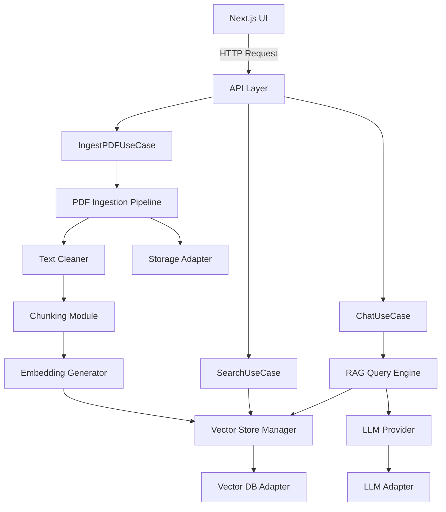

# Component Descriptions

## Overview

This document provides detailed descriptions of each component in the TicoBot system, including their responsibilities, inputs, outputs, and dependencies.

---

## 1. PDF Ingestion Pipeline

### Purpose
Download, extract, and prepare TSE government plan PDFs for processing.

### Responsibilities
- Download PDFs from TSE website
- Validate PDF integrity
- Extract raw text content
- Store original PDFs in storage provider
- Handle download failures and retries

### Inputs
- TSE PDF URLs (list of 20 party documents)
- Storage configuration (Supabase/S3)

### Outputs
- Raw text content per PDF
- Metadata: party name, candidate, PDF URL, file size, download timestamp
- Stored PDF files in cloud storage

### Technologies
- `pdf-parse` or `pdfjs-dist` for text extraction
- HTTP client for downloads
- Storage provider adapter (Supabase Storage / S3)

### Error Handling
- Retry logic for failed downloads (3 attempts)
- Validation of PDF structure
- Logging of extraction failures

### Dependencies
- `StorageProvider` interface
- `DatabaseProvider` interface (for metadata)

---

## 2. Text Cleaner & Normalizer

### Purpose
Clean and normalize extracted PDF text for optimal chunking and embedding.

### Responsibilities
- Remove headers, footers, page numbers
- Normalize whitespace and line breaks
- Fix encoding issues (e.g., Spanish accents)
- Remove non-content elements (images, tables)
- Preserve semantic structure

### Inputs
- Raw text from PDF extraction
- Cleaning configuration (rules, patterns)

### Outputs
- Cleaned, normalized text
- Metadata: original length, cleaned length, cleaning stats

### Transformations
```typescript
// Example transformations
- Remove: "Página 1 de 52"
- Normalize: "educación\n\n\neducación" → "educación educación"
- Fix: "educaci\u00f3n" → "educación"
- Preserve: Section headers, paragraphs, bullet points
```

### Technologies
- Regular expressions for pattern matching
- Unicode normalization (Node.js `normalize()`)
- Custom cleaning rules

### Quality Metrics
- Text reduction percentage (expected: 5-10%)
- Character encoding validation
- Whitespace normalization rate

### Dependencies
- None (pure function)

---

## 3. Chunking Module

### Purpose
Split cleaned text into optimal-sized chunks for embedding and retrieval.

### Responsibilities
- Split text into 800-1500 character chunks
- Apply 100-200 character overlap
- Preserve semantic boundaries (sentences, paragraphs)
- Generate chunk metadata (position, parent document)

### Inputs
- Cleaned, normalized text
- Chunking configuration:
  - Target size: 800-1500 chars
  - Min/max size: 400-2000 chars
  - Overlap: 100-200 chars

### Outputs
- Array of text chunks
- Chunk metadata:
  - `chunk_id`: Unique identifier (e.g., `PLN_2026_pg12_chunk003`)
  - `chunk_index`: Position in document (0-based)
  - `char_start`, `char_end`: Position in original text
  - `parent_document_id`: Source PDF identifier

### Chunking Strategy
```typescript
// Pseudocode
function chunkText(text: string, config: ChunkConfig): Chunk[] {
  const chunks = [];
  let start = 0;

  while (start < text.length) {
    // Find optimal split point (sentence boundary)
    const end = findSplitPoint(text, start, config.targetSize);

    // Extract chunk with overlap
    const chunk = text.slice(start, end);
    chunks.push({
      id: generateChunkId(documentId, chunks.length),
      content: chunk,
      metadata: { /* ... */ }
    });

    // Move forward (accounting for overlap)
    start = end - config.overlap;
  }

  return chunks;
}
```

### Quality Metrics
- Chunk size compliance: 100% within 400-2000 chars
- Semantic coherence: >90% end with sentence terminators
- Overlap consistency: All chunks have specified overlap

### Dependencies
- `Document` entity
- `Chunk` entity

---

## 4. Embedding Generator

### Purpose
Generate vector embeddings for text chunks using configured embedding provider.

### Responsibilities
- Interface with embedding provider (OpenAI, etc.)
- Batch embedding generation
- Handle rate limits and retries
- Cache embeddings for duplicate text

### Inputs
- Text chunks (array)
- Embedding provider configuration
- Batch size (default: 100)

### Outputs
- Vector embeddings (1536-dimensional for text-embedding-3-small)
- Embedding metadata:
  - `model`: Embedding model used
  - `dimensions`: Vector dimensions
  - `tokens_used`: Token count for billing

### Provider Interface
```typescript
interface EmbeddingProvider {
  generateEmbeddings(texts: string[]): Promise<number[][]>;
  getDimensions(): number;
  getModel(): string;
}
```

### Supported Providers
- **OpenAI**: text-embedding-3-small (1536 dims, $0.02/1M tokens)
- **OpenAI**: text-embedding-3-large (3072 dims, $0.13/1M tokens)
- **Cohere**: embed-multilingual-v3.0 (1024 dims)

### Batch Processing
- Process 100 chunks per batch
- Exponential backoff for rate limits
- Progress tracking for large datasets

### Error Handling
- Retry failed embeddings (3 attempts)
- Skip invalid text (log warning)
- Continue processing on partial failures

### Dependencies
- `EmbeddingProvider` interface
- `Chunk` entity

---

## 5. Vector Store Manager

### Purpose
Store, index, and retrieve vector embeddings with metadata.

### Responsibilities
- Store embeddings with metadata
- Build vector indexes for similarity search
- Execute semantic search queries
- Manage vector database connections

### Inputs
- Chunks with embeddings
- Search queries (vector + filters)
- Index configuration

### Outputs
- Indexed embeddings
- Search results with relevance scores

### Provider Interface
```typescript
interface VectorProvider {
  upsertVectors(chunks: Chunk[]): Promise<void>;
  search(query: number[], options: SearchOptions): Promise<SearchResult[]>;
  deleteByFilter(filter: Filter): Promise<void>;
}

interface SearchOptions {
  topK: number;          // Number of results (default: 5)
  minScore?: number;     // Minimum similarity score
  filter?: Filter;       // Metadata filters
}
```

### Supported Providers
- **Supabase (pgvector)**: PostgreSQL extension, cosine similarity
- **Pinecone**: Managed vector database, HNSW indexing
- **Qdrant**: Open-source, supports filtering
- **Weaviate**: GraphQL API, hybrid search

### Index Configuration
```typescript
{
  vectorDimensions: 1536,
  indexType: "hnsw",        // Hierarchical Navigable Small World
  metric: "cosine",         // Similarity metric
  efConstruction: 200,      // Index build quality
  m: 16                     // Max connections per node
}
```

### Search Performance
- Target: <100ms for top-5 results
- Index size: 5,000-15,000 vectors initially
- Query caching for frequent searches

### Dependencies
- `VectorProvider` interface
- `Chunk` entity
- `SearchResult` entity

---

## 6. RAG Query Engine

### Purpose
Execute Retrieval-Augmented Generation queries using vector search + LLM.

### Responsibilities
- Convert user questions to embeddings
- Retrieve relevant chunks via vector search
- Build context from retrieved chunks
- Generate answers using LLM with context
- Track sources and citations

### Inputs
- User question (natural language)
- Search configuration (top-K, filters)
- LLM configuration (model, temperature, max tokens)

### Outputs
- Generated answer
- Source citations (chunk IDs, party names)
- Relevance scores
- Token usage statistics

### RAG Pipeline


### Context Building
```typescript
function buildContext(results: SearchResult[]): string {
  const context = results.map((result, i) => {
    return `[${i + 1}] ${result.metadata.party} - ${result.metadata.section}
${result.content}
Source: ${result.metadata.source}`;
  }).join('\n\n---\n\n');

  return context;
}
```

### Prompt Template
```
Eres un asistente experto en planes de gobierno de Costa Rica 2026.

Usa SOLO la información del contexto para responder la pregunta.
Si no encuentras la respuesta en el contexto, di "No encuentro esa información en los planes de gobierno".

CONTEXTO:
{context}

PREGUNTA:
{question}

RESPUESTA:
```

### Quality Metrics
- Groundedness: 100% (no hallucinations)
- Relevance: >80% (top-5 results relevant)
- Answer quality: Manual evaluation

### Dependencies
- `EmbeddingProvider` interface
- `VectorProvider` interface
- `LLMProvider` interface
- `SearchResult` entity

---

## 7. Provider Abstraction Layer

### Purpose
Abstract external service providers (LLM, vector DB, storage) behind interfaces.

### Responsibilities
- Define provider contracts (interfaces)
- Implement provider factory/registry
- Enable runtime provider switching
- Manage provider configurations

### Provider Interfaces

```typescript
// LLM Provider
interface LLMProvider {
  generateText(prompt: string, options: LLMOptions): Promise<LLMResponse>;
  streamText(prompt: string, options: LLMOptions): AsyncGenerator<string>;
  getModel(): string;
}

// Vector Provider
interface VectorProvider {
  upsertVectors(chunks: Chunk[]): Promise<void>;
  search(query: number[], options: SearchOptions): Promise<SearchResult[]>;
  deleteByFilter(filter: Filter): Promise<void>;
}

// Database Provider
interface DatabaseProvider {
  saveDocument(document: Document): Promise<void>;
  getDocument(id: string): Promise<Document | null>;
  listDocuments(filter?: Filter): Promise<Document[]>;
}

// Storage Provider
interface StorageProvider {
  uploadFile(file: Buffer, path: string): Promise<string>;
  downloadFile(path: string): Promise<Buffer>;
  deleteFile(path: string): Promise<void>;
}
```

### Provider Registry
```typescript
class ProviderRegistry {
  private llmProviders: Map<string, LLMProvider>;
  private vectorProviders: Map<string, VectorProvider>;

  registerLLM(name: string, provider: LLMProvider): void;
  getLLM(name: string): LLMProvider;

  registerVector(name: string, provider: VectorProvider): void;
  getVector(name: string): VectorProvider;
}
```

### Configuration
```typescript
// Environment-based provider selection
const config = {
  llm: {
    provider: process.env.LLM_PROVIDER || 'openai',
    model: process.env.LLM_MODEL || 'gpt-4.1',
    apiKey: process.env.LLM_API_KEY
  },
  vector: {
    provider: process.env.VECTOR_PROVIDER || 'supabase',
    url: process.env.VECTOR_URL,
    apiKey: process.env.VECTOR_API_KEY
  }
};
```

### Dependencies
- All provider implementations

---

## 8. Next.js UI

### Purpose
Provide user interface for exploring government plans and querying via RAG.

### Responsibilities
- Display PDF list with metadata
- Search and filter documents
- Chat interface for RAG queries
- Provider/model selection
- Admin dashboard (future)

### Pages/Routes
```
/                          # Home page
/documents                 # PDF list
/documents/[id]            # Single document view
/search                    # Search interface
/chat                      # RAG chat interface
/admin                     # Admin dashboard (future)
```

### Key Components
```typescript
// Chat Interface
<ChatInterface
  onSendMessage={handleMessage}
  messages={messages}
  isLoading={isLoading}
  providers={availableProviders}
/>

// Document List
<DocumentList
  documents={documents}
  onSelect={handleDocumentSelect}
  filters={filters}
/>

// Search Results
<SearchResults
  results={searchResults}
  onResultClick={handleResultClick}
/>
```

### State Management
- **React Context**: Global app state (user preferences, selected providers)
- **SWR/React Query**: Data fetching and caching
- **Local State**: Component-specific state

### Styling
- **TailwindCSS**: Utility-first styling
- **shadcn/ui**: Component library
- **Dark Mode**: Support for dark/light themes

### Internationalization
- **Primary Language**: Spanish (Costa Rican audience)
- **Secondary Language**: English (future)

### Dependencies
- Backend API
- TailwindCSS
- Next.js App Router

---

## Component Interaction Summary



Each component is designed to be:
- **Independently testable**
- **Swappable** (via provider abstraction)
- **Scalable** (stateless where possible)
- **Maintainable** (single responsibility)
