# Data Flow Diagrams

## Overview

This document provides comprehensive data flow diagrams for all major workflows in the TicoBot system.

---

## 1. PDF Ingestion Flow

### High-Level Flow

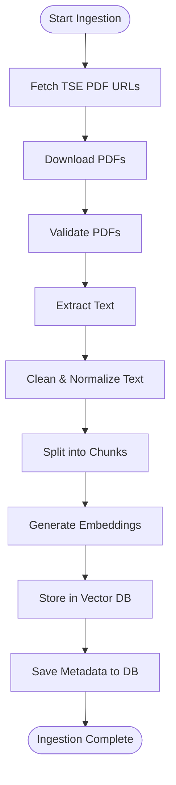

### Detailed Ingestion Flow with Components

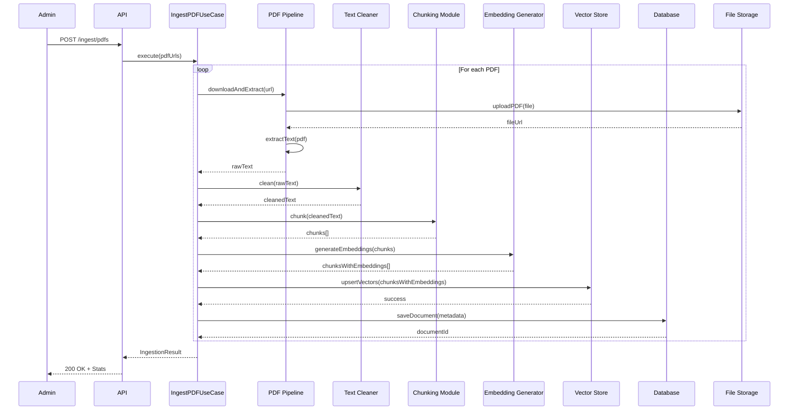

### Data Transformations

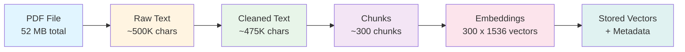

---

## 2. Search Query Flow

### Semantic Search Flow

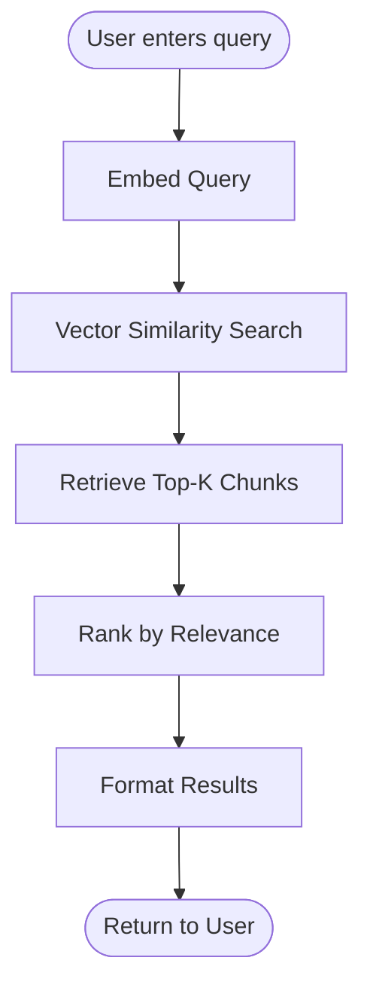

### Detailed Search Flow

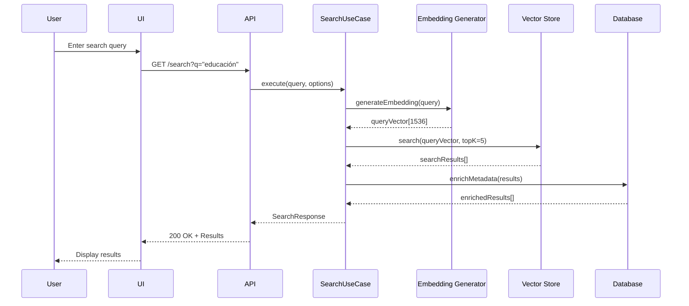

### Search Result Structure

```typescript
{
  query: "¿Qué proponen sobre educación?",
  results: [
    {
      chunk_id: "PLN_2026_pg12_chunk003",
      content: "Proponemos invertir 8% del PIB en educación...",
      score: 0.87,
      metadata: {
        party: "PLN",
        candidate: "José María Figueres",
        page: 12,
        section: "Educación",
        source: "https://www.tse.go.cr/2026/planesgobierno/pln.pdf"
      }
    },
    // ... 4 more results
  ],
  totalResults: 5,
  processingTimeMs: 87
}
```

---

## 3. RAG Chat Flow

### RAG Pipeline Flow

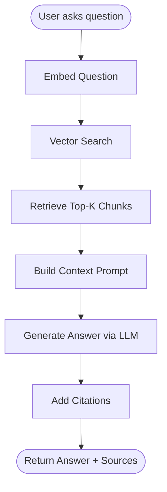

### Detailed RAG Flow

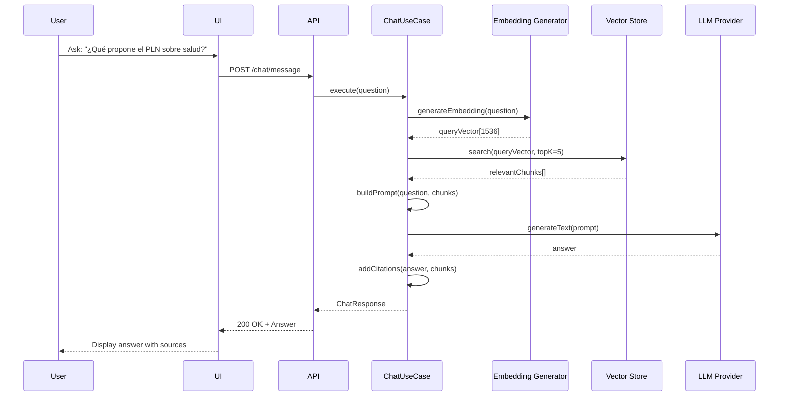

### Context Building Process

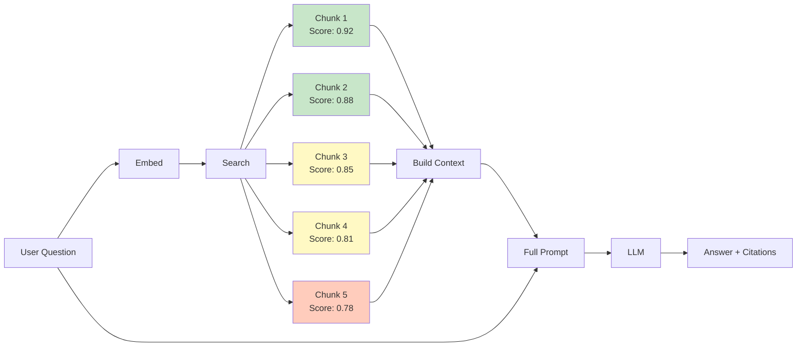

### RAG Prompt Template

```
System: Eres un asistente experto en planes de gobierno de Costa Rica 2026.

Usa SOLO la información del contexto para responder la pregunta.
Si no encuentras la respuesta en el contexto, di "No encuentro esa información en los planes de gobierno".

CONTEXTO:
[1] PLN - Salud
Proponemos fortalecer el sistema de salud mediante...
Source: PLN Plan de Gobierno 2026, pág. 15

[2] PUSC - Salud
Nuestro plan de salud incluye...
Source: PUSC Plan de Gobierno 2026, pág. 22

[... más chunks ...]

PREGUNTA:
¿Qué propone el PLN sobre salud?

RESPUESTA:
```

---

## 4. Provider Switching Flow

### Runtime Provider Switching

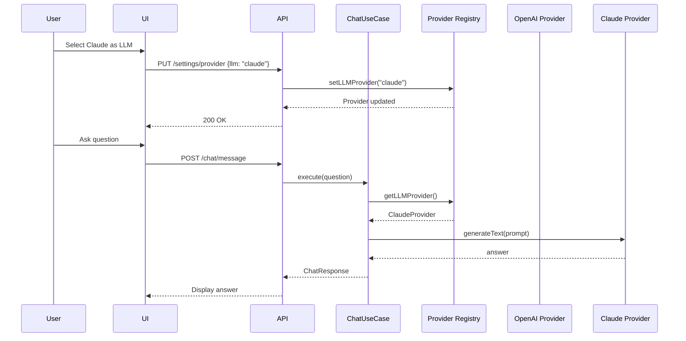

### Multi-Provider Comparison Flow

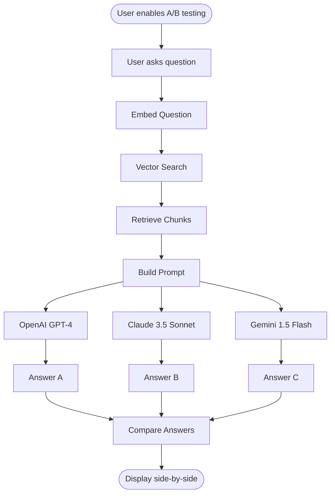

---

## 5. Batch Processing Flow

### Bulk PDF Ingestion

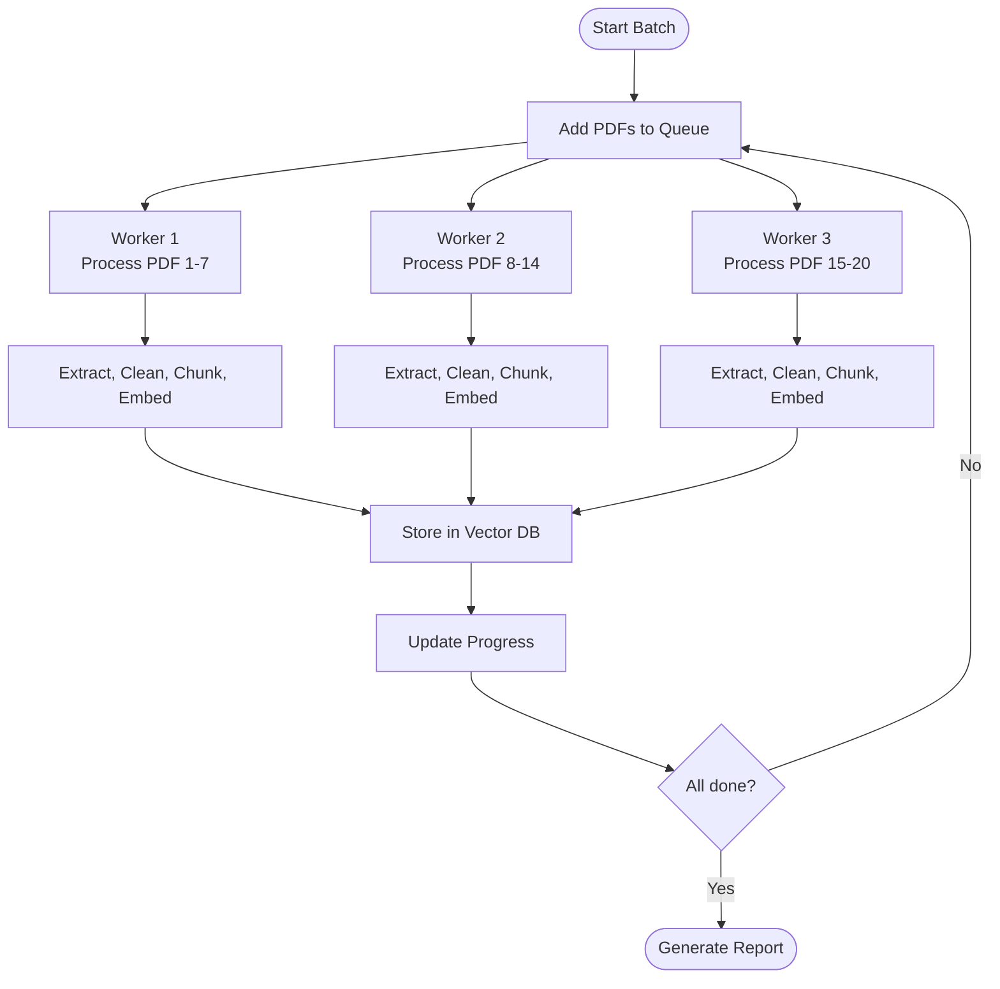

### Batch Progress Tracking

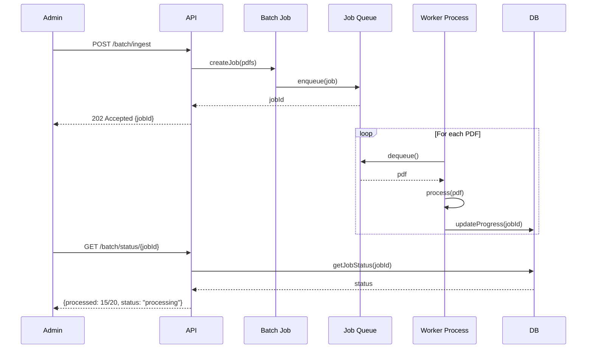

---

## 6. Error Handling Flow

### Retry Logic for Failed Embeddings

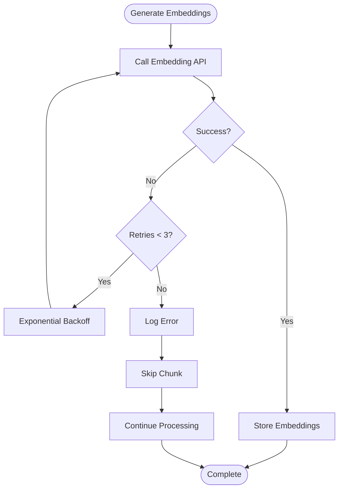

### Graceful Degradation

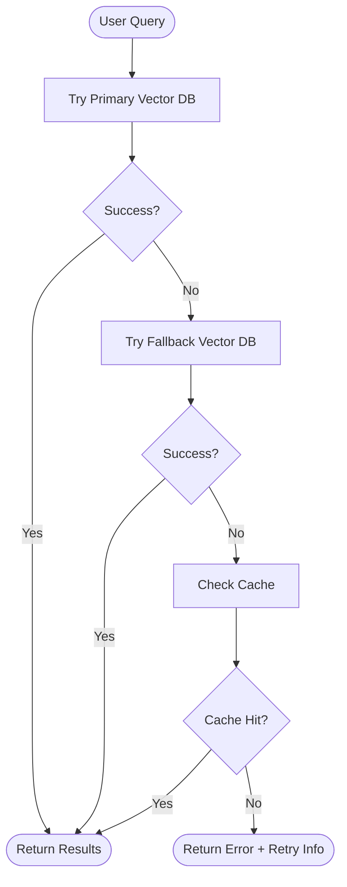

---

## 7. Caching Flow

### Query Result Caching

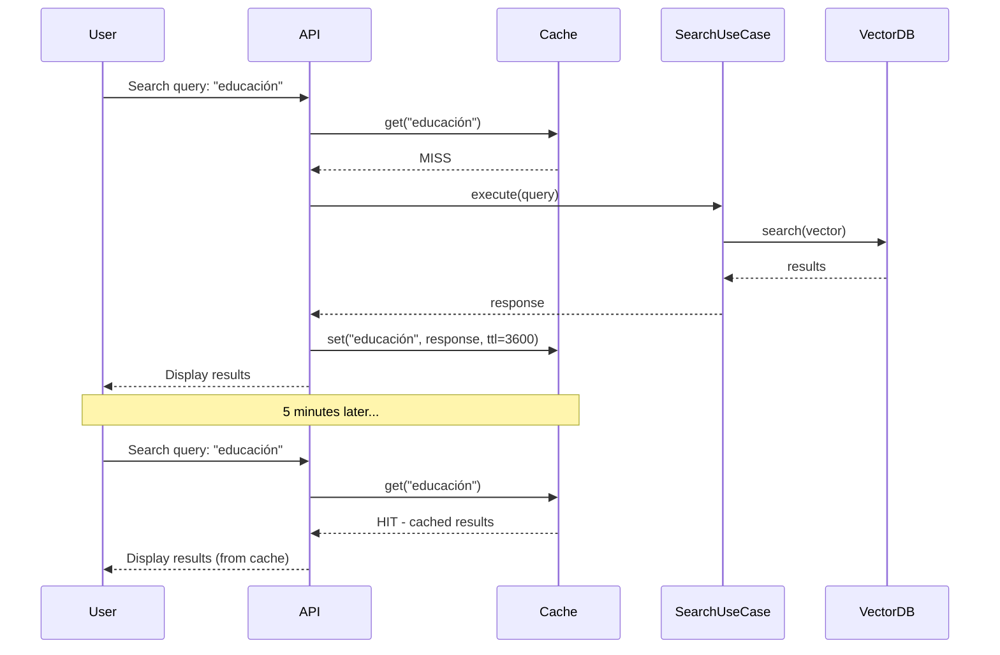

### Cache Invalidation

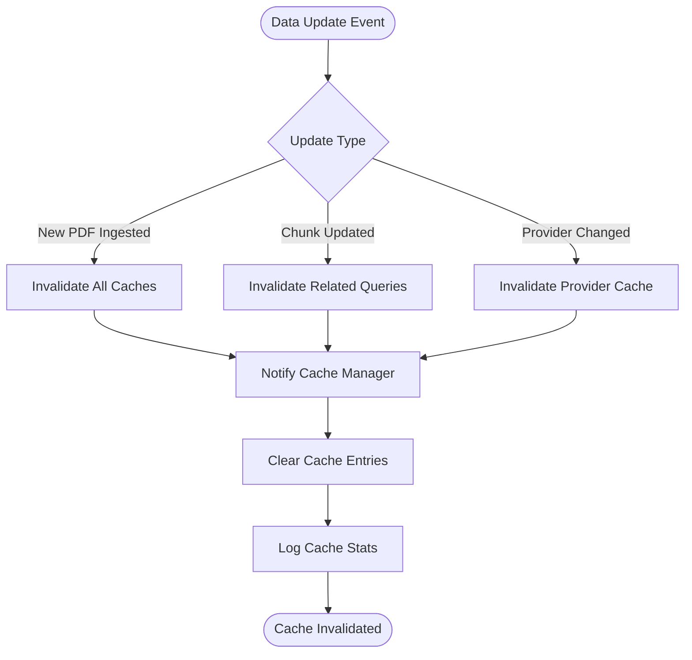

---

## Data Flow Summary

### Complete System Data Flow

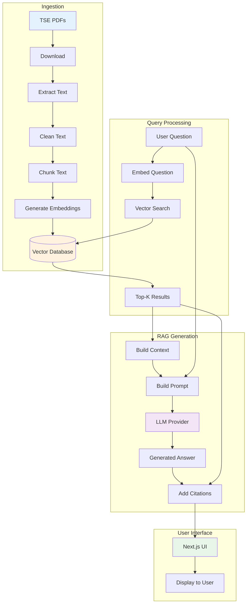

---

## Performance Considerations

### Bottleneck Analysis

| Component | Expected Latency | Optimization Strategy |
|-----------|------------------|----------------------|
| PDF Download | 1-5s per PDF | Parallel downloads (3 workers) |
| Text Extraction | 0.5-2s per PDF | Use fast parser (pdfjs-dist) |
| Embedding Generation | 0.1-0.5s per batch | Batch 100 chunks at a time |
| Vector Search | <100ms | HNSW indexing, query caching |
| LLM Generation | 2-10s | Streaming responses, caching |

### Data Volume Estimates

```
Input:  20 PDFs × 2.6 MB avg = 52 MB
Text:   ~500K characters total
Chunks: ~300 chunks × 1.5KB avg = 450 KB
Vectors: 300 × 1536 dimensions × 4 bytes = 1.8 MB
Storage: 52 MB (PDFs) + 1.8 MB (vectors) + 0.5 MB (metadata) = ~54 MB
```

---

## Next Steps

After understanding these data flows, proceed to:
1. **Task 1.4**: Implement provider interfaces based on these flows
2. **Task 1.5**: Structure backend folders to support these flows
3. **Task 1.6**: Implement RAG pipeline following these diagrams
